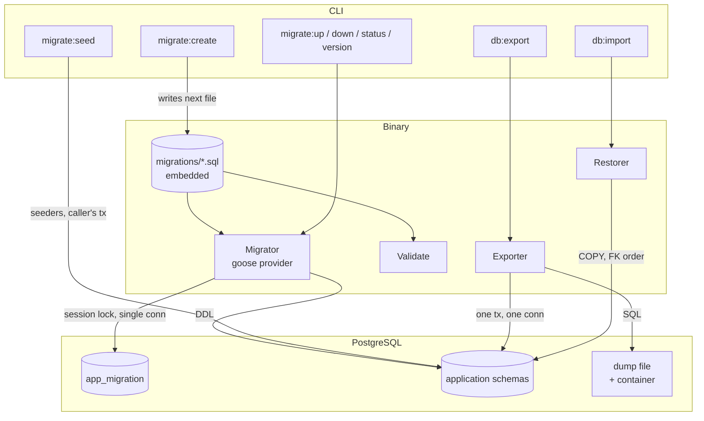

# Database

Database is tango's schema layer: the goose migrations embedded in the binary — the single
source of schema truth — plus the engine that applies them and the dump/restore tooling built
on top. The application never creates tables at runtime and never embeds DDL anywhere else.

> **Relation to the datastore:** the migrator runs on its own single connection
> (`datastore.OpenMigrationDB`), never on the pool — goose takes a session advisory lock, so a
> pool could hand the lock and the migration statements to different backends. The dump and
> restore each hold one pooled connection inside one transaction.
>
> **Relation to the commands:** the CLI surface (`migrate:*`, `db:*`) lives in `cmd/`; this
> package owns the engine. The migrator returns plain structs (`Migration`,
> `MigrationStatus`) so `cmd/` never imports goose.

## Features

- **Embedded migrations** — `migrations/*.sql` ships inside the binary; a new file runs only
  after a rebuild, and `migrate:validate` checks them without a database or a connection
- **Session-locked, one connection** — goose runs with a Postgres session locker over the
  single handle, so two instances cannot apply the same migration
- **Owned version table** — `app_migration` (not goose's default name), resolved through the
  connection's `current_schema()`
- **Plain-struct results** — `Migration` (version, name, duration, empty) and
  `MigrationStatus` (version, name, applied, applied at); goose stays an implementation detail
- **Live progress** — `MigratorOptions.Progress` receives one event per step as it happens,
  translated from goose's verbose log (goose has no hook of its own; a custom slog handler is
  the bridge)
- **Exact rollback** — `Down` rolls back one migration at a time, in the order goose
  recorded — exact even for out-of-order migrations, which a version comparison cannot
  express
- **Identity rewind** — `ResetIdentity` rewinds the version table's identity sequence after a
  full rollback, so ids keep meaning something; the sentinel row is kept, because goose
  refuses to run without the zero-version row
- **Dump/restore round trip** — `COPY` in text format, PK-ordered rows, idempotent DDL
  replay, foreign-key-ordered load, one transaction, never a torn snapshot; the file is
  compressed only after the dump is complete
- **Destructive by consent** — a restore confirms before it starts; `--force` is what a
  script passes, `--dry-run` what a cautious one does
- **Compression containers** — `none`, `gzip`, `zlib`, `zip` (klauspost/compress), with
  byte-level format detection on restore
- **Structural validation** — the checks goose would reject at apply time, plus the shapes
  goose tolerates but this project forbids, reported with file and line
- **Idempotent seeders** — default records behind `migrate:seed`, safe to run repeatedly,
  each guarded with `ON CONFLICT DO NOTHING`

## Architecture



**Ordering is the whole trick.** The DDL half of a dump is one writer per object kind, in
restore order — extensions, enums, tables (columns first, then PK/unique, then foreign keys),
indexes, functions, triggers — with every statement taken from the server's own deparse
helpers (`pg_get_constraintdef`, `pg_get_functiondef`, …) and extension-owned objects skipped
(`pg_depend.deptype = 'e'`). The data half streams each table `COPY`-ordered by primary key,
so a restore is deterministic. The importer reorders COPY blocks by foreign-key dependence
before loading and truncates everything before any row is written — a TRUNCATE cascade is the
only way Postgres accepts emptying a referenced table.

**One transaction, one connection, both directions.** The dump reads one snapshot, so a
concurrent write cannot tear it; the restore loads one transaction, so a failure half way
leaves the target untouched. The dump header records the server version and the database name
— never the DSN, because a dump is a file that gets copied around.

## Requirements

- Go >= 1.27
- PostgreSQL >= 18 (`uuidv7()` in the schemas)
- `github.com/pressly/goose/v3` — the migration engine, used as a library
- `github.com/klauspost/compress` — the dump containers
- Docker for the tests (testcontainers)

## Wiring

The package lives inside the `tango` module and is not published. `cmd/` builds the migrator
from the single-connection handle and the `database` config section, and the task targets wrap
the commands one to one (`db:migrate` → `migrate:up`, `db:rollback` → `migrate:down`,
`db:validate` → `migrate:validate`) — a renamed command silently breaks a task, so the pair
moves together.

Migrations are embedded: **a new file runs only after a rebuild.** `task db:validate` checks
the set before you rely on it.

## Quick Start

### 1. Add a Migration

```bash
task db:create -- add_widgets
```

`CreateMigration` writes the next skeleton — `Up` and `Down` blocks in place — and refuses a
name already in use at any version, so two migrations can never share a name or a version.
The rules the version must satisfy:

- five digits (`MigrationPrefixWidth`), one past the highest version on disk
- a version that no longer fits five digits is refused (`ErrMigrationVersionOverflow`)
- keep versions at `00001` and above: goose skips a `00000_*.sql` file silently, which is the
  trap the version assertions in the migrator tests exist for
- every file needs `-- +goose Up` and `-- +goose Down` blocks

### 2. Migrate

```bash
task db:migrate                        # up, every pending migration
task db:rollback                       # down, one migration
task db:rollback -- --count 3          # down, three
task db:status                         # every embedded migration with its state
task run -- migrate:version            # the value only, for scripts
task db:validate                       # structural checks, no database needed
```

Both directions take `--dry-run`, which lists what would run and touches nothing.

### 3. Seed

```bash
task run -- migrate:seed               # the idempotent default records
task run -- migrate:seed --dry-run     # what it would create, writes nothing
```

A seeder is a factory file in `database/seeders/`, named `<Entity>Seeder`, appended to `All()`
in dependency order. `Apply` receives the shared `datastore.Querier` — **the command owns the
transaction**, which keeps a failed seeder from leaving a partial seed behind and lets a dry
run pass the pool directly. Every insert is guarded with `ON CONFLICT DO NOTHING`, and
existing records are reported as skipped.

### 4. Export and Import

```bash
task db:export -- --output backup.sql --compression gzip
task db:import -- --input backup.sql.gz --truncate --force
```

The default output is `storage/backup/tango-<YYYYMMDD_hhmm>.sql` (UTC); a generated name that
already exists is not replaced without `--overwrite`, so a second export in the same minute
cannot lose the first dump. `--schema-only` / `--data-only` select halves (a data-only dump
restores onto a schema `migrate:up` has provided; the two are mutually exclusive). The
container is written after the dump is complete and detected by bytes on import, not by file
name.

A restore is destructive, so it asks before it starts — it replaces rows in the tables the
dump carries, and `--truncate` empties every table first. A script passes `--force`; a
`--dry-run` reports what would be loaded and touches nothing.

## API Reference

### `NewMigrator(ctx, db *sql.DB, opts MigratorOptions) (*Migrator, error)`

Loads the embedded migrations and prepares the goose provider. `db` must be the
single-connection handle from `datastore.OpenMigrationDB`. With `Progress` set, goose runs
verbose and its log records arrive as `ProgressEvent`s; without it, goose logs nothing and the
command prints the results itself.

### `(*Migrator).Up(ctx)` / `UpTo(ctx, version)` / `Down(ctx, count)`

The apply and rollback surfaces. An up-to-date database applies nothing; a rollback that runs
out of applied migrations stops early, which is not an error; a failed rollback returns the
migrations that did roll back alongside the error.

### `(*Migrator).Status(ctx)` / `Pending(ctx)` / `Applied(ctx)` / `Version(ctx)`

The read surfaces. `Applied` is newest-first — the order a rollback consumes — and is an
approximation of goose's recorded order when `--allow-out-of-order` is in use.

### `(*Migrator).HighestVersion()` / `(*Migrator).ResetIdentity(ctx)`

The version a full `Up` reaches, and the sequence rewind a full rollback needs.

### `Validate() ValidationReport` / `ValidateFS(fsys fs.FS)`

The structural checks over the embedded files — or any filesystem, so fixtures can exercise
them. It does not parse SQL: a malformed statement inside a block is caught when goose
executes it, not here.

### `NewExporter(connector, DumpOptions)` / `(*Exporter).Dump(ctx, w, progress)`

The dump. `DumpOptions` selects `SchemaOnly` or `DataOnly`; the writer receives the SQL, the
progress callback one event per table.

### `NewRestorer(connector, truncate bool)` / `(*Restorer).Restore(ctx, rd, progress)`

The load. The container is detected from the stream's first bytes; COPY blocks are reordered
by foreign-key dependence and loaded in one transaction.

### `ParseCompression(value string) (Compression, error)`

Reads a `--compression` value; empty means `none`.

## Testing

Tests run against a real Postgres (testcontainers, Postgres 18) through the shared
`pkg/testutils.StartPostgres`; each test migrates its own database (`NewDatabase`), so no
state leaks. The dump/restore round trip is exercised end to end in `backup_test.go`, and
every new dump object kind adds its case there.

```bash
go test ./database/
go test -tags debug ./cmd/... ./database/...
```

## Design Decisions

| Decision | Rationale |
| -------- | --------- |
| Migrations embedded in the binary | The binary is the deployable unit; a version and its schema travel together |
| goose as a library, behind plain structs | The engine is replaceable; `cmd/` and the tests never see goose's types |
| Single connection, session lock | A session advisory lock and a pool disagree about backends; the lock must stay with its statements |
| Owned version table name | The schema reads as the project's, and `current_schema()` keeps it relocatable |
| One-migration-at-a-time rollback | Exact for out-of-order histories, which a version comparison cannot express |
| Identity rewind after rollback | The sentinel row stays (goose requires version 0), only the sequence moves — so ids keep meaning something |
| COPY text format, PK-ordered | A deterministic, diffable dump; a restore replays in a known order |
| Server deparse helpers for DDL | The server's own rendering cannot drift from what it actually enforces |
| Restore reorders by foreign keys, truncates first | Referenced tables load before parents are populated; a restore replaces, not collides |
| klauspost/compress for all containers | One dependency, three formats, byte-level detection on read |
| Structural validation without a database | The mistakes goose rejects at apply time are catchable in CI before a connection exists |
| Caller owns the seed transaction | A failed seeder leaves no partial seed; a dry run needs nothing to roll back |
| DSN never in a dump header | A dump is a file that gets copied around |
