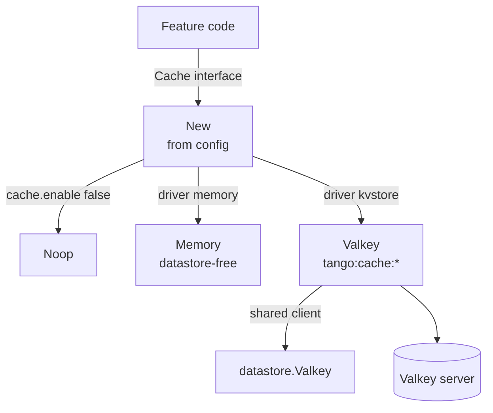

# Cache

Cache is tango's key-value cache layer: one `Cache` contract, three drivers — in-process
memory, the optional Valkey backend, and the Noop that caches nothing. The composition root
picks one from the configuration; a feature never checks whether caching is on.

> **Relation to the datastore:** the Valkey driver reads through the shared
> `datastore.Valkey` client — the factory never opens one. With `kvstore.enable` false, the
> kvstore driver degrades to Noop rather than opening a second client.
>
> **Origin:** the in-memory driver follows the fastcache design (index + chunks, one big
> allocation), keyed by `maphash` with collision-safe byte comparison; the batch operations
> and the monotonic expiry were adopted from studying `github.com/samber/hot`. Neither is a
> dependency — the ideas are, the code is not.

## Features

- **One contract, no branches in features** — `New` hands back whichever driver applies, or
  Noop, so a call site is identical in every deployment and the answer to "cached?" is
  simply "no" where caching does not run
- **Zero-allocation reads** — `Get` appends into the caller's buffer, so a hot call site
  reuses it and a hit allocates nothing
- **Batch operations** — `GetMany`/`SetMany`/`DelMany`: one MGET, one pipelined `DoMulti`,
  one DEL per batch on the remote driver; the round-trip saving is the point
- **Monotonic expiry** — the memory driver measures TTLs on a monotonic clock
  (`cacheEpoch` + `monotonicNow`), so a wall-clock adjustment cannot expire or resurrect
  entries
- **Bounded memory** — the in-memory driver holds a byte budget (`cache.max_memory`); when
  the budget runs out it resets itself, keeping the memory it already owns rather than
  growing without bound
- **Remote-safe by contract** — every method carries the caller's context: the Valkey driver
  owns a network round trip, and a cancelled request must not pay for one
- **Namespace prefix on the shared backend** — the Valkey driver keys under `tango:cache:`,
  so the same server can carry other data without a collision
- **Off by default** — `cache.enable` is false, so a feature that has not decided to be
  cacheable cannot grow one by accident

## Architecture



**The Cache interface** is bytes and strings: `Get`, `GetMany`, `Set`, `SetMany`, `Del`,
`DelMany`. An entry is a serialized payload, so the driver never inspects what it holds. A
TTL of zero or less means the driver's configured default.

**Memory** keeps entries in one large allocation with an index over them; expiry compares
against a process-lifetime monotonic timestamp. **Valkey** maps each call onto one command
(or one pipeline for a batch) under the `tango:cache:` prefix. **Noop** answers every read
with a miss and drops every write.

## Requirements

- Go >= 1.27 (`maphash`, `slices`/`maps` idioms)
- `internal/datastore` — only for the kvstore driver, only when the backend is enabled

## Wiring

The composition root wires it in `internal/registry`:

```go
var cacheProvider = do.ProvideNamed( injector, "cache", func(i *do.Injector) cache.Cache {
	return cache.New(cfg, kv) // kv is nil unless kvstore.enable
})
```

A feature takes `cache.Cache` as a dependency and never asks which driver it got.

## Quick Start

### 1. Read Through the Cache

```go
// The append-style read: dst is reused across calls, so a hot path
// allocates only when the value grows.
buf, ok := c.Get(ctx, buf[:0], "user:"+id)
if ok {
	return decode(buf) // hit
}
user := loadUser(ctx, id) // miss
if enc, err := encode(user); err == nil {
	c.Set(ctx, "user:"+id, enc, time.Hour)
}
```

### 2. Batch

```go
found := c.GetMany(ctx, keys)      // one round trip on the remote driver
c.SetMany(ctx, items, time.Minute) // one pipeline
c.DelMany(ctx, keys)               // one DEL per key, one round trip
```

A single hot read stays on `Get`, which appends into the caller's buffer and allocates
nothing; `GetMany` pays for the map a batch needs to be useful.

### 3. Invalidate

```go
c.Del(ctx, "user:" + id)
```

There is no cross-instance invalidation story beyond the TTL: a cached entry is a serialized
payload with a lifetime, not a distributed state machine.

## Configuration

| Key | Default | Description |
| --- | ------- | ----------- |
| `cache.enable` | false | The switch every driver answers to; a driver configured while the cache is off is never read |
| `cache.driver` | `memory` | `memory` or `kvstore`; read only while the cache is enabled |
| `cache.ttl` | 300 (5m) | The default lifetime of an entry; a per-call TTL of zero or less means this |
| `cache.max_memory` | 33554432 (32 MiB) | The in-memory driver's byte budget; exhausted, it resets itself |

The kvstore driver additionally requires `kvstore.enable` and the shared client —
`Validate` refuses the contradiction of a kvstore driver with the backend switched off.

## API Reference

### `New(cfg config.Config, kv *datastore.Valkey) Cache`

The factory a composition root calls. Returns Noop for a disabled cache, a kvstore driver
without its backend, or an unknown driver.

### `Get(ctx, dst []byte, key string) ([]byte, bool)`

Appends the entry into `dst`; the returned slice is valid until the caller reuses `dst`.

### `GetMany(ctx, keys []string) map[string][]byte`

The entries found and not expired, keyed as asked.

### `Set(ctx, key, value []byte, ttl time.Duration)` / `SetMany(ctx, items, ttl)`

Store until the TTL elapses; zero or less means the configured default. A set never disturbs
an entry under a different key.

### `Del(ctx, key)` / `DelMany(ctx, keys)`

Removals, best-effort by the nature of a cache.

## Testing

The memory driver is tested without a backend; the Valkey driver runs against a real server
(testcontainers) through `pkg/testutils.StartValkey`. Benchmarks cover the zero-allocation
read path:

```bash
go test ./internal/cache/
go test -bench . -benchmem ./internal/cache/
```

## Design Decisions

| Decision | Rationale |
| -------- | --------- |
| Noop as a first-class driver | A feature never branches on the caching question; a disabled cache is a miss, not an error |
| Bytes and strings only | A cache entry is a serialized payload; the driver never inspects what it holds |
| Append-style `Get` | A hot call site reuses its buffer; a hit costs no allocation |
| Batch operations on the interface | The remote driver's round trip is the cost worth batching; the memory driver loops |
| Monotonic expiry in memory | A wall-clock adjustment (NTP, container migration) must not expire or resurrect entries |
| Reset on budget exhaustion | Predictable bound instead of unbounded growth or an eviction heuristic to tune |
| `tango:cache:` prefix | One shared backend may carry other data; the namespace is the collision answer |
| Off by default | A feature that has not decided to be cacheable cannot grow one by accident |
| Context on every method | The remote driver owns a network round trip; a cancelled request must not pay for one |
