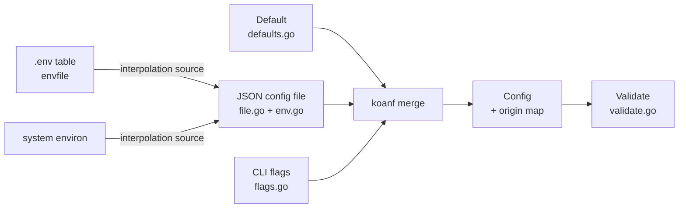

# Config

Config is tango's configuration system: one JSON config file as the source of truth, the
built-in defaults below it, command-line flags above it, and the environment as a value table
the file references — never a layer of its own.

> **Relation to the commands:** a command never reads a flag or a variable directly. It reads
> the resolved value from the context (`configFrom` / `fullConfigFrom` in `cmd/config.go`),
> which is what keeps the precedence in one package.
>
> **Relation to secrets:** every secret key is listed once (`secretKeys`), and every rendering
> path — `Redacted`, `RedactDSN`, `RedactKVURL` — reads that one list, so a new secret is
> added there and nowhere else.

## Features

- **Three sources, one order** — built-in defaults → JSON config file → CLI flags, merged
  last-wins per key (not per section): a source that sets one leaf leaves its siblings alone
- **The file is required** — a missing file is an error, not a fallback to defaults; a run
  with no configuration is not a configuration anyone chose
- **The environment is not a layer** — a variable reaches a key only where the file
  references it (`env:NAME` as a whole value, `${NAME}` inline), so a stray export in a shell
  cannot alter a run
- **Interpolation keeps secrets out of the file** — only the file is interpolated; a
  variable's own value is data
- **Observable precedence** — a resolved Config records which source last set each key
  (`Origin` / `Origins`), so a caller tells a file value from a flag value without re-deriving
  the precedence
- **Durations as seconds** — a duration key is written as a plain number of seconds
  (`900`, not `"15m0s"`); a duration string is still accepted (`durationKeys`)
- **Lists and maps from strings** — a list key written as one comma-separated string becomes
  the list the field wants; the same for maps (`lists.go`)
- **Unknown keys are dropped** — a key that is not part of `Config` cannot replace a section
  with a scalar and break the decode
- **Validation is a separate step** — `Load` never validates, so a command that needs one key
  is not blocked by one it never reads; `Validate` runs where the whole configuration is
  required, and reports unresolved interpolations
- **Every key has a home** — a default in `Default`, a rule in `Validate`, a secret line in
  `secretKeys`; `config:generate` writes the file a fresh checkout starts from
- **Deferred resolution** — `initConfig` stores the result *and* the failure on the command
  context; only the command that reads it reports the error, so `config:generate` and
  `key:generate` work without a resolvable file

## Architecture



**The struct is the schema.** `Config` and its sections (`types.go`) define every key, its
default, and its rule. Adding a key means adding a field with a koanf and a json tag, a
default, and a rule — the key then works in every source at once.

**Key names are dotted paths.** `database.max_conns` is also the variable name the generated
file and `.env.example` use (`EnvName`) — a convention for what the file writes, not a mapping
the loader applies.

## Requirements

- Go >= 1.27 (`encoding/json/v2`, `maps`/`slices` idioms)
- `github.com/knadh/koanf/v2` — the merge engine; the layers are flattened before they merge
- `github.com/riipandi/tango/pkg/envfile` — the dotenv table the file's directives resolve from

## Wiring

The package lives inside the `tango` module and is not published. Every command resolves
through `cmd/config.go`: `initConfig` runs before the action, stores the outcome on the
context, and the action calls `configFrom` (or `fullConfigFrom` when it will validate) — a
command that never reads the config never reports its errors.

Flags reach the configuration only through `flagBindings` in `flags.go`, and only `serve` has
any (`--host`, `--port`, `--base-url`). A flag that changes what a command does (`--dry-run`,
`--force`) must never be listed, and a key gets no variable of its own — `storage.local_path`
has neither.

## Quick Start

### 1. Read the Resolved Configuration

```go
func someCommandAction(ctx context.Context, cmd *cli.Command) error {
	cfg, err := configFrom(ctx, cmd) // fullConfigFrom when you will validate
	if err != nil {
		return err
	}
	_ = cfg.Database.URL // the value the precedence decided
	...
}
```

### 2. Add a Key

1. A field on the section in `types.go`, with koanf and json tags
2. A default in `defaults.go`
3. A rule in `validate.go` (read only when its section is named)
4. A line in `secretKeys` when it is a secret — and nowhere else
5. `config:generate` and `.env.example` pick it up; the task targets (`task check`) verify
   the generated file and the sample stay in step

### 3. Generate the File

```bash
task run -- config:generate   # writes app.config.json a fresh checkout starts from
```

Secrets stay out of the file by interpolation:

```json
{
	"database": { "url": "env:DATABASE_URL" },
	"app": { "secret_key": "${SECRET_KEY}" }
}
```

## API Reference

### `Load(opts Options) (Config, error)`

Resolves every source in the documented order and unmarshals into the defaults, so a key no
source set keeps its default. Never validates.

### `(*Config).Validate() error`

Checks the whole configuration: refused values, contradictions (a driver naming a backend that
is not enabled), and unresolved interpolations, reported with the variable name.

### `(*Config).Origin(key string) string` / `Origins() map[string]string`

Which source last set a key — `LayerDefault`, `LayerConfigFile`, or `LayerFlag`.

### `(*Config).Unresolved() map[string]string`

The keys whose directive named a variable that is not set, mapped to the variable name. The
key keeps its default until `Validate` reports it.

### `Redacted(cfg Config) string` / `RedactDSN` / `RedactKVURL`

The only rendering paths a configuration may take in a log or a report. All read the one
`secretKeys` list.

## File Layout

One file per stage of a Config's life — a single-function file is refused:

| File | Stage |
| ---- | ----- |
| `types.go` | The schema: `Config` and every section |
| `defaults.go` | `Default()` and the default constants |
| `keys.go` | Dotted key names, `secretKeys`, `envKeys` |
| `file.go` | The JSON file layer: locate, read, flatten |
| `env.go` | Interpolation: `env:NAME`, `${NAME}`, the dotenv table |
| `flags.go` | `flagBindings` — the only door a flag passes |
| `validate.go` | The rules a resolved configuration must satisfy |
| `duration.go`, `lists.go` | Normalization: seconds, comma-separated lists, inline maps |
| `config.go` | `Load`, merge, origin tracking |
| `sample.go`, `meta.go` | The generated sample file and metadata (`config:generate`) |

## Testing

Unit tests run without a database; the precedence, interpolation, duration, list, and
validation behaviors each have their own file-scoped suite:

```bash
go test ./internal/config/
```

## Design Decisions

| Decision | Rationale |
| -------- | --------- |
| The file is the source of truth, the env a value table | A stray export in a shell cannot alter a run; the file decides which keys exist |
| The file is required | A run with no configuration is not a configuration anyone chose |
| Last-wins per key, not per section | A flag that overrides one leaf must not blank its siblings |
| `Load` never validates | A migration that needs one key must not be blocked by one it never reads |
| Deferred resolution on the context | `config:generate` and `key:generate` must work where no file resolves |
| Flags only through `flagBindings` | A flag that changes what a command does is a CLI concern, not a configuration one |
| Durations as plain seconds | The file stays machine-written; a duration string is accepted, not required |
| One `secretKeys` list | Every redaction path reads the same list, so a secret cannot leak through a second renderer |
| One file per stage | The schema, the defaults, and the rules are each one grep away |
