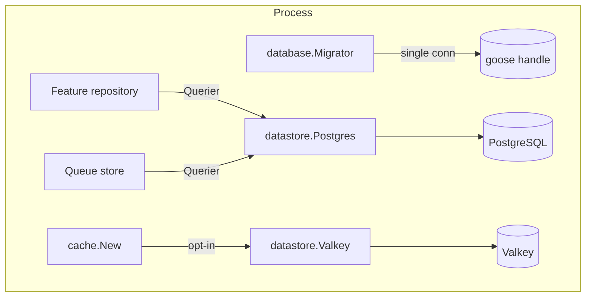

# Datastore

Datastore owns the two clients of the process: the single PostgreSQL connection pool and the
optional Valkey (Redis-compatible) client. Nothing else in the codebase opens a pool, a
driver connection, or a second client — a second cache of the same server could not be
invalidated together.

> **Relation to the repositories:** a repository takes the shared `Querier` surface, never
> `*pgxpool.Pool`. The pool and a transaction both satisfy it, so the same repository code
> runs inside and outside a transaction.
>
> **Relation to the migrator:** goose runs on its own single connection
> (`OpenMigrationDB` / `MigrationDB`), never on the pool — a migration holds one backend
> session for its whole run.

## Features

- **One pool, verified at startup** — `NewPostgres` pings before it returns, so an
  unreachable database fails at startup instead of on the first query
- **`Querier`** — the `Exec`/`Query`/`QueryRow` surface the pool and a transaction share; a
  repository accepts either without knowing which it got
- **`WithTx`** — commit on nil, roll back on error *and on panic*; the deferred rollback uses
  a context that survives caller cancellation, so an aborted request still releases the
  transaction
- **Session parameters on every connection** — `search_path` and `timezone` live in the
  pool's `RuntimeParams`, so pgxpool resets a reused connection back to them; the pool never
  hands out a connection on the wrong schema or clock
- **Single-connection migration handle** — `OpenMigrationDB` builds it from the same options
  without a pool; the caller owns and closes it
- **`Acquire`** — a connection held across several statements, for `LISTEN` or session-level
  advisory locks; released by the caller
- **Pool defaults with explicit overrides** — max 10 / min 2 connections, 1h lifetime,
  30m idle, 1m health check, 5s connect timeout; zero fields fall back, non-sensical
  combinations are refused
- **Optional Valkey client** — opt-in via `kvstore.enable`; pinged at construction, so an
  unreachable server fails at startup; `DB` selects the logical database without rewriting
  the URL's own
- **`ErrNoRows` re-exported** — repositories compare against it without importing pgx
  themselves

## Architecture



**The pool is the process's single Postgres identity.** Every query, transaction, seeder, and
queue store rides it; its configuration comes from the `database` config section, whose fields
mirror `PostgresOptions` one to one.

**Session defaults.** `search_path` is `public,internal,reference` — the schemas migration
`00000` creates — and `timezone` is `UTC`, so timestamps never depend on the host or container
clock. A pre-migration connection still succeeds: Postgres ignores a schema that does not
exist yet.

## Requirements

- Go >= 1.27
- PostgreSQL >= 18 (`uuidv7()` in the schemas; pgx v5)
- `github.com/valkey-io/valkey-go` — only when the key-value backend is enabled

## Wiring

The package lives inside the `tango` module and is not published. The composition root wires
it in `internal/registry`: the pool from the `database` config section, the Valkey client only
when `kvstore.enable` is set, both as `samber/do` providers every other provider takes from.

The pool is closed in the injector's shutdown walk; the Valkey client closes with it.

## Quick Start

### 1. Open the Pool

```go
pool, err := datastore.NewPostgres(ctx, datastore.PostgresOptions{
	DSN:             cfg.Database.URL,
	ApplicationName: cfg.App.Identifier,
	MaxConns:        cfg.Database.MaxConns,
	MinConns:        cfg.Database.MinConns,
	MaxConnLifetime: cfg.Database.MaxConnLifetime,
	MaxConnIdleTime: cfg.Database.MaxConnIdleTime,
	HealthCheckPeriod: cfg.Database.HealthCheckPeriod,
	ConnectTimeout:  cfg.Database.ConnectTimeout,
	SearchPath:      cfg.Database.SearchPath,
	Timezone:        cfg.Database.Timezone,
})
```

The registry does this; shown here for what it wires.

### 2. Query Through `Querier`

```go
type Repo struct{ db datastore.Querier }

func (r Repo) Count(ctx context.Context) (int64, error) {
	var n int64
	err := r.db.QueryRow(ctx, "SELECT count(*) FROM widgets").Scan(&n)
	return n, err
}
```

### 3. Transact

```go
err := pool.WithTx(ctx, func(ctx context.Context, tx datastore.Querier) error {
	if _, err := tx.Exec(ctx, "INSERT INTO orders (...) VALUES (...)"); err != nil {
		return err
	}
	return orderRepo(tx).Insert(ctx, order) // the same repository, the tx as its db
})
```

The callback commits on nil and rolls back on anything else — including a panic. The
transaction is enqueued with the change that caused it or not at all.

### 4. Migration Handle

```go
// Standalone (the migrate commands), or from the running pool:
db, err := pool.MigrationDB(ctx)
defer func() { _ = db.Close() }()
// hand it to database.NewMigrator
```

## API Reference

### `NewPostgres(ctx, opts PostgresOptions) (*Postgres, error)`

Opens the pool and pings. Refuses an empty DSN (`ErrMissingDSN`), a negative `MinConns`, and
a `MinConns` above `MaxConns`.

### `(*Postgres).WithTx(ctx, fn func(ctx, tx Querier) error) error`

The transaction wrapper every multi-statement write goes through.

### `(*Postgres).Acquire(ctx) (*pgxpool.Conn, error)`

One connection for work that needs several statements on the same backend. The caller
releases it.

### `(*Postgres).MigrationDB(ctx) (*sql.DB, error)` / `OpenMigrationDB(ctx, opts)`

The single-connection handle goose runs on. The caller owns and closes it.

### `(*Postgres).Ping / Stats / Close`

Reachability, pool counters (for health reporting), and the shutdown drain.

### `NewValkey(ctx, opts ValkeyOptions) (*Valkey, error)`

The optional key-value client, pinged at construction. `URL` accepts the `redis`, `rediss`,
and `unix` schemes; `ApplicationName` names the client in the server's client list.

## Testing

Tests run against a real Postgres (testcontainers, Postgres 18) through the shared
`pkg/testutils.StartPostgres` helper; each test migrates its own database (`NewDatabase`), so
no state leaks between tests. The Valkey suite uses `StartValkey`.

```bash
go test ./internal/datastore/
go test -race ./internal/datastore/
```

## Design Decisions

| Decision | Rationale |
| -------- | --------- |
| One pool, one client, by rule | A second cache of the same server cannot be invalidated together; a second pool doubles the connection count |
| `Querier` as the repository surface | The same repository code runs inside and outside a transaction; pgx stays an implementation detail |
| Session parameters in `RuntimeParams` | pgxpool resets a reused connection with them; a startup query would be lost on the first reuse |
| Rollback on a context that survives cancellation | An aborted request must still release its transaction, or the pool fills with abandoned ones |
| Ping at construction | An unreachable database is a startup failure, not a mystery on the first query |
| goose on its own connection | A migration holds one backend session for its whole run; the pool's recycling must not touch it |
| Valkey strictly opt-in | Postgres plus in-process memory are enough for the default path; a local checkout needs no second server |
| `ErrNoRows` re-exported | Repositories compare against it without each importing pgx |
