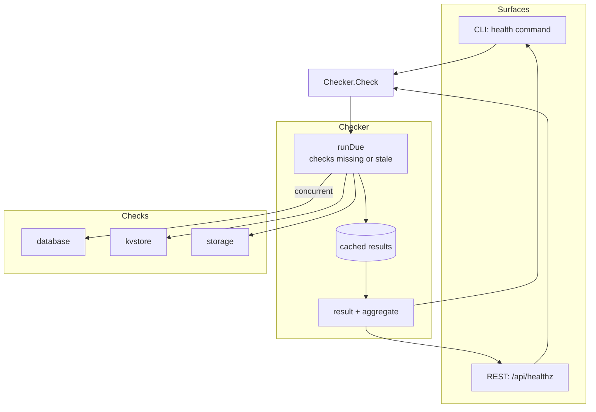

# Health

Health aggregates dependency checks into one availability status, reported identically by two
surfaces: the CLI's `health` command and the REST `/api/healthz` endpoint. The result is the
same object either way, so a probe and an operator never disagree about the state of the
system.

> **Relation to the checks:** the check functions live beside the engine
> (`check_database.go`, `check_kvstore.go`, `check_storage.go`) and are registered in the
> composition root. Their names are generic — `database`, `kvstore`, `storage` — never the
> product, because the report is published by an endpoint anyone can read.
>
> **Origin:** the design follows `github.com/alexliesenfeld/health` without depending on it —
> named check functions, an aggregated status, a per-check result with a timestamp, a result
> cache, and a global timeout a check can shorten.

## Features

- **One engine, two surfaces** — the CLI prints the result as text or JSON; the REST handler
  sends the same object inside the standard API envelope, so the two never drift
- **Concurrent checks** — every due check runs at once, so one slow dependency does not delay
  the others; the call never outlives the configured timeout
- **Panic-safe and deadline-safe** — a check that panics becomes a down entry instead of
  taking the process down; a check that ignores its context cannot hold up the aggregate past
  the deadline
- **Result cache** — a check result is reused for `cache_ttl` (1 second by default), so a
  probe loop does not hammer the dependencies; zero disables the cache
- **Optional components** — a check marked optional is reported but does not affect the
  aggregated status, so a missing optional backend is not a failure
- **Deterministic wire form** — durations in milliseconds, details as an ordered array (by
  check name), info entries flattened to the top level and sorted: a diff of two identical
  probes is byte-identical
- **Status listener** — a function called when the aggregated status changes, for a caller
  that wants to react to transitions
- **Per-check target** — a check may name what it inspected (a DSN host, a directory) for the
  text report; the published JSON carries it only for surfaces an operator owns

## Architecture



**Two vocabularies, on purpose.** A component is `up` or `down` (plus `unknown` before it has
run); the system is `healthy` or `unhealthy`. Only a healthy aggregate serves traffic; an
unknown component is not a passing one. Optional entries are reported but never change the
aggregate.

**A probe cannot crash the server.** The check function runs in its own goroutine: a panic is
recovered into an error, and a caller that ignores its context is answered by the deadline
branch instead.

## Requirements

- Go >= 1.27 (`encoding/json/v2`, `maps`/`slices` idioms)
- `github.com/dustin/go-humanize` — readable counts and uptimes
- `pkg/printext` — the text report's colour; the meaning of a status word is decided here,
  only its rendering is the caller's

## Wiring

The composition root registers the checks and builds the `Checker`; `serve` mounts
`Handler` at `/api/healthz`, and `cmd`'s `health` command runs the same checker for the CLI.
Both stop when the process stops — the Checker holds no background goroutines, it runs the
checks when asked.

## Quick Start

### 1. Add a Check

```go
	checker := health.NewChecker(
		health.WithInfo(map[string]string{"version": version, "mode": cfg.App.Environment}),
		health.WithInfoFunc(health.Uptime(started)),
		health.WithCheck(health.DatabaseCheck(pool, dbTarget)),
		health.WithCheck(health.StorageCheckWithTarget(storageRoot)),
		// Added only while the backend is enabled: a disabled backend is
		// never dialled, so reporting it down would describe a dependency
		// the application does not have.
		health.WithCheck(health.KVStoreCheck(kv, kvTarget)),
		health.WithTimeout(5*time.Second),
		health.WithCacheTTL(time.Second),
	)
```

A check needs a name and a function; a duplicate name, an empty name, or a nil function panics
at construction — a check set is assembled at startup from code, not from user input. An info
key must not shadow a wire field (`status`, `details`, `took_ms`).

### 2. Serve It

```go
// The REST endpoint: 200 when every required check passed, 503 otherwise,
// Cache-Control: no-store so a probe never reads a stale status.
mux.Handle("GET /api/healthz", health.Handler(checker))
```

### 3. Run It from a Shell

```bash
task run -- health          # the text report
task run -- health --json   # the wire form
task run -- health --short  # one word: healthy
```

The text report is a flat list, one fact per line, so it greps and pipes:

```
name: tango
version: 0.0.0
uptime: 3 hours
status: healthy
duration: 1.234 ms
checks: 2 up, 0 down
postgres: up (localhost:5432/postgres)
storage: up (/srv/storage)
```

Every line is `<key>: <value>`, and a failing check carries its error on the same line, so
`grep ': down'` finds every problem.

## API Reference

### `NewChecker(options ...Option) *Checker`

Builds the checker. Panics on an invalid check set — a check set is wiring, not user input.
Concurrency-safe, no background goroutines.

### `(*Checker).Check(ctx context.Context) Result`

Runs every check with no fresh result, concurrently, and returns the aggregate. The cache
makes a probe loop cheap; the timeout bounds the whole call, and a check's own `Timeout` can
only shorten it.

### `(*Checker).Checks() []string`

The configured check names, in the order they were added — a way to describe what will be
verified before running it.

### `Result` / `CheckResult`

The aggregate (`Status`, `Details`, `Duration`, `Info`) and one entry per check (`Name`,
`Target`, `Status`, `Error`, `Timestamp`, `Duration`, `Optional`). `Failed()` names the down
checks; `Message(result)` says it in one line.

### `Handler(checker *Checker) http.HandlerFunc`

The REST surface: `responder.Success` with the result on healthy, `responder.Fail` with the
message and the result on not — 503, so a load balancer acts on the status code alone.

### `Failure(name string, err error) Result`

The result of a component that could not be reached at all, such as a pool that failed to
open — printed and serialized the same way a run check would be.

### `WriteText(w, result, styler)` / `WriteShort(w, result)`

The CLI's renderings. `WriteShort` prints one word — the same word the JSON `status` carries —
for a script that reads without parsing.

## Wire Form (JSON)

```json
{
	"status": "healthy",
	"details": [
		{
			"name": "database",
			"status": "up",
			"timestamp": "2026-09-22T12:00:00Z",
			"took_ms": 1.234
		}
	],
	"took_ms": 2.5,
	"version": "0.0.0",
	"uptime": "3 hours"
}
```

Details are an ordered array (by check name), durations are fractional milliseconds, and the
info entries are flattened to the top level after the fixed fields, sorted by key.

## Testing

The check suites run against real containers through `pkg/testutils` where the dependency
needs one; the engine's suites cover the cache, the timeout, the panic path, the listener,
and both renderings:

```bash
go test ./internal/health/
```

## Design Decisions

| Decision | Rationale |
| -------- | --------- |
| One result object for both surfaces | A probe and an operator must never disagree; two renderers of one state drift |
| Generic check names | The report is published by an endpoint anyone can read; no product name, no DSN, no URL in it |
| Checks run concurrently | One slow dependency must not delay the others behind it |
| A check's own goroutine + recovered panics | A probe must not be able to crash the server or hang past the deadline |
| Result cache with a short TTL | A probe loop would otherwise hammer the dependencies every time |
| Optional checks | A missing optional backend is a fact to report, not a failure to act on |
| Two status vocabularies | A component is up/down; the system is healthy/unhealthy — conflating them makes "up" ambiguous |
| Deterministic JSON | `took_ms` not nanoseconds, ordered details, sorted flattened info — two identical probes diff as identical |
| Static info outranks computed info | A build fact stays fixed; an info function cannot override it |
| Checker holds no goroutines | It runs when asked; the cache is what keeps that cheap |
