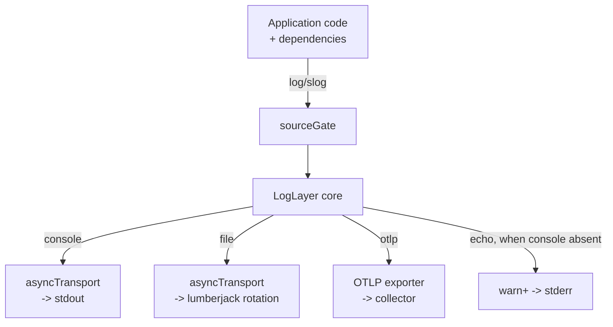

# Logger

Logger wires the process's logging stack: one LogLayer core behind a `*slog.Logger`, with the
sinks the configuration names — the console, a rotating file, and an OpenTelemetry exporter,
in any combination. Application code never touches LogLayer; it calls slog, and this package
decides where the entry goes.

> **Relation to the observer:** the OTLP sink is built from `internal/observer`'s exporter
> plumbing (`GRPCTransport`, `TLSConfig`, `Compressor`, `SignalPath`) rather than carrying a
> copy — one collector receives every signal, and the two packages describe the same service
> from the same configuration.
>
> **Relation to feature code:** `Slog()` is the only frontend. A dependency that accepts a
> `*slog.Logger` is handed this one and lands in the same pipeline.

## Features

- **One frontend** — `log/slog` is what every caller uses; the LogLayer core is an
  implementation detail of it, and `With`/`WithGroup` work as slog defines them
- **Configuration-driven sinks** — `log.transport` names the sinks and their order; every
  sink is one the configuration named, so a run writes where the file says and nowhere else
- **Zero-drop async sinks** — the console and file sinks write from background workers with
  a bounded queue; `Flush`/`Shutdown` drain what is queued, so a graceful stop loses nothing
- **Echo fallback** — a run without the console transport still carries warnings and errors
  to stderr, so an operator watching the service hears when something is wrong without a
  second copy of every line
- **Source location is debug-only** — the `sourceGate` handler zeroes `Record.PC` above
  debug: a file path tells a reader where the code lives, and only a developer tracing a
  problem keeps it — at the frontend, so the rule holds for every destination at once
- **Error chains survive** — the unwrapping error serializer turns a wrapped or joined error
  into a `causes` array, so what `errors.Join` built reaches the entry
- **Correlated with traces** — prefer the `*Context` methods: the OTLP sink correlates the
  record with the span the context carries
- **Fails rather than degrades** — a sink that cannot be built is an error, not a silent
  downgrade to the console; nothing is left open when construction fails part way through
- **Rotating file with a fixed home** — the file sink writes under the one data directory
  (`storage.local_path/logs`); there is no filename key to disagree with the configuration

## Architecture



**Sink lifecycle.** Each async sink holds a queue only a drain can flush; the file sink owns
a descriptor; the collector owns a queue nothing else can flush. `Logger` holds them so
`Shutdown` releases each in the right order — the collector first (with the caller's
context), then the async sinks, then the inner transports, only after their queue is empty.

**The configuration is the only source.** `New` reads the resolved `config.Config` — level,
transport list, per-sink settings — and fails on an unknown transport rather than skipping
it: a sink that was asked for and quietly not built is the failure the transport list exists
to prevent.

## Requirements

- Go >= 1.27 (`log/slog`)
- `go.loglayer.dev/v3` + `go.loglayer.dev/integrations/sloghandler/v3` — the core and the
  slog bridge; per-transport packages for the console, the file, and OTLP
- `github.com/natefinch/lumberjack` — the file rotation
- `internal/observer` — only when the OTLP transport is named (shared exporter plumbing)

## Wiring

The composition root wires it in `internal/registry` from the `log` config section; `serve`
hands the built `*slog.Logger` to every component — including the queue and the scheduler —
so every log line reaches every configured sink and carries the run's trace context. The
logger shuts down through the injector's walk (`Shutdown`), after the drains that may still
write into it.

Feature code binds, never rebuilds:

```go
type Service struct{ log *slog.Logger }
// registry: service{log: logger.Slog()}
```

## Quick Start

### 1. Log

```go
sl.InfoContext(ctx, "served", "status", 200)
sl.With("request_id", id).Info("handled") // request-scoped fields via slog's own With
sl.WarnContext(ctx, "retrying", "attempt", 2, "err", err)
```

`Slog()` returns the same `*slog.Logger` every time — bind it in a struct field; reach
through it only for a one-off line.

### 2. Ship to a Collector

```json
{
	"log": {
		"level": "info",
		"transport": ["console", "file", "otlp"]
	}
}
```

The list says both which sinks exist and in what order they are written; duplicates are
refused by `Validate`. Prove it end to end with `task metrics:up` +
`LOG_TRANSPORT=console,file,otlp task metrics:smoke`, then `task metrics:query`.

### 3. Flush and Shut Down

```go
logger.Flush()   // entries queued before the call are written
logger.Shutdown(ctx) // collector first, then async sinks; safe to call twice
```

## Configuration

| Key | Default | Description |
| --- | ------- | ----------- |
| `log.level` | info | `debug`, `info`, `warn`, or `error` |
| `log.transport` | `["console"]` | The sinks, in write order: `console`, `file`, `otlp` |
| `log.console.format` | pretty | `pretty` (human, CLI) or `structured` (JSON) — the only sink with a rendering choice, because it is the one a person reads |
| `log.file.max_size` | 100 | Megabytes the active file reaches before rotation |
| `log.file.max_backups` / `max_age` | 7 / 30 | Rotated files kept; a file is deleted when either limit is exceeded (zero on both keeps them forever) |
| `log.file.compress` | true | Gzip rotated files |
| `log.otlp.path` | — | The collector route for logs; empty means the protocol's own `/v1/logs` |
| `log.otlp.timeout` | 10 | Seconds bounding one export attempt |

There is no filename key: the file sink writes under `storage.local_path/logs`. The OTLP
address is deliberately not here — one collector serves every signal, so where it is belongs
to `otel.endpoint`.

## API Reference

### `New(cfg config.Config, opts ...Option) (*Logger, error)`

Builds the sinks the transport list names and the LogLayer core behind them. Options override
the console writer and the echo writer — what tests use to read what was emitted.

### `(*Logger).Slog() *slog.Logger`

The frontend, and the only one. Bind it; do not rebuild it.

### `(*Logger).SetDefault()`

Installs the logger as the process default, so a package that logs through slog without being
handed one lands in the same pipeline.

### `(*Logger).Flush()`

Drains every async sink without stopping it — what a test reads its destination after.

### `(*Logger).Shutdown(ctx context.Context) error`

Flushes and releases every sink: collector first, then console and file, each drain bounded
by the caller's context and reported when it misses the deadline. Idempotent.

## Testing

The console sink takes a writer and the OTLP sink is covered against a real collector
(testcontainers, `StartVictoriaLogs`); the async drains, the level mapping, the source gate,
the correlation, and the every-transport-ships-the-same-entry rule each have their suite:

```bash
go test ./internal/logger/
```

Prove the pipeline end to end with the metrics stack: `task metrics:up`, then
`LOG_TRANSPORT=console,file,otlp task metrics:smoke`, then `task metrics:query -- 'marker:"tango-logger-smoke"'`.

## Design Decisions

| Decision | Rationale |
| -------- | --------- |
| slog as the only frontend | One logging idiom; a dependency that takes a `*slog.Logger` lands in the same pipeline; LogLayer's own API would be the same information said twice |
| LogLayer as the engine behind the handler | Multi-transport fan-out (console, file, OTLP) with one core; the slog handler keeps the frontend standard |
| Sinks named by a list, not switches | Naming one is what turns it on; there is no second flag that could disagree with the list |
| Zero-drop async with explicit drains | A slow destination must not slow a request; a graceful stop must not lose what was queued |
| Echo sink for console-less runs | An operator watching the service still hears warnings; a file-only deployment does not get every line twice |
| Source location only at debug | A file path tells a reader where the code lives; the gate sits at the frontend so the rule holds for every sink |
| Unwrapping error serializer | An `errors.Join` chain reaches the entry instead of only its top message |
| Flattened metadata | The entry reads the way slog's own JSON handler writes it — the shape the frontend's callers already know |
| No filename key for the file sink | The data directory is one (`storage.local_path`); a second opinion about where files live is a disagreement waiting to happen |
| Fails rather than degrades | A deployment that asked for a file or a collector and did not get one has lost the logs it is being trusted with |
