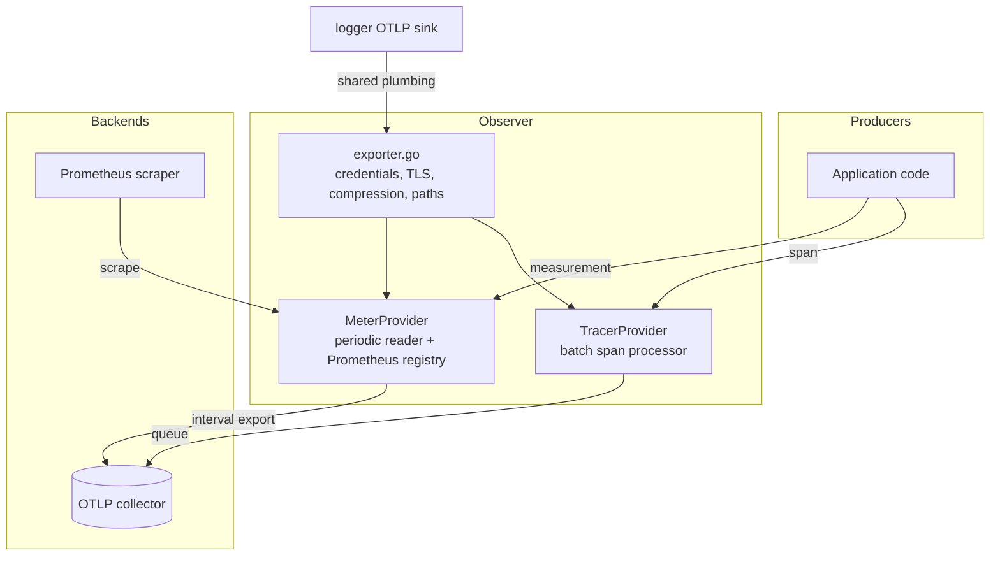

# Observer

Observer wires the process's traces and metrics: the two OpenTelemetry signals, opt-in, with
the resolved configuration as the only source of truth. It also owns the exporter plumbing
every OTLP exporter of the process shares — including the logger's log sink.

> **Relation to the logger:** logging is not here — `internal/logger` owns it — but the
> signals share one collector address and one resource, so both packages describe the same
> service from the same configuration. The logger's OTLP sink consumes this package's
> exporter plumbing rather than carrying a copy.
>
> **Relation to the config:** the OpenTelemetry SDK reads `OTEL_*` variables on its own. This
> package closes that door: every exporter option and every resource attribute is passed
> explicitly, because a stray export in a shell must not be able to redirect telemetry or
> rename the service.

## Features

- **Nothing on the request path blocks** — spans go through a batch span processor,
  measurements through a periodic reader; recording enqueues and returns, so a slow,
  unreachable, or absent collector costs dropped telemetry and never a slow request
- **Bounded queues, oldest dropped** — `otel.queue.max_size` bounds what each signal buffers;
  when full, the oldest item is dropped and the SDK counts it; nothing waits for room
- **The environment is not a source** — transport credentials, TLS, compression, headers, and
  signal routes are all set explicitly, which is what stops an exporter from applying
  `OTEL_EXPORTER_OTLP_*` on its own
- **One collector address** — `otel.endpoint` serves every signal; a signal whose collector
  routes it elsewhere overrides only its own path, never its own address
- **Opt-in per signal** — a run that enables nothing dials nothing and needs no collector;
  a disabled signal is an absent endpoint, not an empty one
- **Fails rather than degrades** — a signal that cannot be built is an error, not a silent
  downgrade to the no-op provider; nothing is left open when construction fails part way
- **Prometheus bridge** — the metric reader also exposes a scrape endpoint at
  `otel.metrics.prometheus_path`, served from a fresh registry so only this application's
  instruments appear
- **Sampler as the cost knob** — `always`, `never`, `ratio`, or `parent_ratio`; the
  parent-ratio form keeps a received sampled trace whole instead of sampling its own half away

## Architecture



**Construction and shutdown.** `New` builds the tracer provider first, the meter provider
second — `Shutdown` drains in reverse, so the metric provider stops before the tracer provider
it does not depend on. A configuration with every signal off returns a usable Observer with
nothing switched on, so a caller never checks whether it may call `Shutdown`.

**The fresh registry.** The Prometheus exposition serves this application's instruments and
nothing a dependency registered globally: a Go runtime collector, a driver's pool statistics,
or a library's own metrics would otherwise be attributed to this service. A service that
wants the process collectors registers them here, deliberately.

## Requirements

- Go >= 1.27
- OpenTelemetry SDK + OTLP exporters (`otlptracegrpc`/`otlptracehttp`,
  `otlpmetricgrpc`/`otlpmetrichttp`) and `prometheus/client_golang`
- A collector — only when a signal is enabled (`task metrics:up` runs the local stack)

## Wiring

The composition root wires it in `internal/registry` from the `otel` config section; `serve`
starts it and shuts it down through the injector's walk. `MetricsHandler` is mounted only when
it is non-nil — the honest answer for a disabled signal is no endpoint, not one that reports
nothing.

Prove tracing and metrics end to end:

```bash
task metrics:up
OTEL_TRACING_ENABLE=true OTEL_METRICS_ENABLE=true task metrics:smoke:otel
task metrics:traces   # and the tango_otel_smoke_total query against VictoriaMetrics
```

## Quick Start

### 1. Emit a Span and a Measurement

```go
tracer := otel.Tracer("mymodule")
ctx, span := tracer.Start(ctx, "enqueue")
defer span.End()

counter, _ := meter.Int64Counter("mymodule.enqueued_total")
counter.Add(ctx, 1)
```

The recording call enqueues and returns; the background processors carry it out.

### 2. Configure

```json
{
	"otel": {
		"endpoint": "http://localhost:4318",
		"service_name": "tango",
		"environment": "staging",
		"protocol": "http/protobuf",
		"compression": "gzip",
		"tracing": { "enable": true, "sampler": "parent_ratio", "ratio": 0.1 },
		"metrics": { "enable": true, "interval": 60, "prometheus_path": "/metrics" }
	}
}
```

Headers authenticate the sender where the collector checks them; a header value is a secret by
default and is rendered through the same path every secret takes.

## Configuration

| Key | Default | Description |
| --- | ------- | ----------- |
| `otel.endpoint` | — | The collector's OTLP address; the scheme decides whether HTTP is TLS. Read when any signal is enabled |
| `otel.service_name` | app identifier | The service every signal is attributed to |
| `otel.environment` | — | The deployment a signal came from — a resource attribute |
| `otel.protocol` | `http/protobuf` | The wire protocol every signal is sent with — `http/protobuf`, `http/json`, or `grpc`; a collector accepts one protocol per listener |
| `otel.compression` | gzip | `gzip` or `none` (none saves the CPU on a loopback collector) |
| `otel.headers` | — | Sent with every export; values are secrets |
| `otel.queue.max_size` | 4096 | What one signal buffers before dropping the oldest |
| `otel.tracing.enable` | false | Export spans |
| `otel.tracing.sampler` | always | `always`, `never`, `ratio`, `parent_ratio` |
| `otel.tracing.ratio` | 1.0 | The fraction `ratio`/`parent_ratio` record |
| `otel.tracing.batch_timeout` | 5 | Seconds a span waits in the queue before it ships |
| `otel.tracing.max_batch_size` | 512 | Spans in one export |
| `otel.tracing.path` | — | Route override; empty means the endpoint's path or `/v1/traces` |
| `otel.tracing.export_timeout` | 10 | Seconds bounding one trace export |
| `otel.metrics.enable` | false | Record and export metrics |
| `otel.metrics.interval` | 60 | Seconds between exports |
| `otel.metrics.export_timeout` | 10 | Seconds bounding one metrics export |
| `otel.metrics.path` | — | Route override; empty means the endpoint's path or `/v1/metrics` |
| `otel.metrics.prometheus_path` | `/metrics` | The scrape route of the Prometheus bridge; empty means no exposition |

Never a second collector address: a different route sets a path.

## API Reference

### `New(ctx, cfg config.Config) (*Observer, error)`

Builds the observer the configuration describes. Every signal off → an empty, usable Observer;
a signal that cannot be built → an error with everything built so far shut down.

### `(*Observer).Shutdown(ctx context.Context) error`

Drains the providers in reverse construction order. Called by the injector's shutdown walk.

### `(*Observer).MetricsHandler() http.Handler`

The Prometheus exposition, or nil when metrics are switched off.

### `GRPCTransport(secure bool)` / `TLSConfig(secure bool)` / `Compressor(name string)` / `SignalPath(configured, endpointPath, fallback string)`

The exporter plumbing shared with the logger's OTLP sink: explicit credentials and TLS close
the `OTEL_EXPORTER_OTLP_CERTIFICATE` door at the point the exporter opens it; `SignalPath`
prefers the configured path, then keeps an endpoint that already names one, then falls back to
the protocol's own route.

## Testing

`internal/observer/observer_test.go` covers the same ground the smoke command proves against
Docker — construction refusals, sampler selection, resource attributes, the signal routes —
without a collector:

```bash
go test ./internal/observer/
```

The gRPC export paths are exercised against a real collector in `grpc_test.go`
(testcontainers).

## Design Decisions

| Decision | Rationale |
| -------- | --------- |
| Explicit exporter options, no env fallback | The SDK's own `OTEL_*` reading is a second configuration source; a stray export must not redirect a signal |
| Batch/periodic export off the request path | A slow or absent collector costs dropped telemetry, never a slow request |
| Bounded queues, oldest dropped | The alternative is unbounded memory or blocking producers; the SDK counts what it dropped |
| One collector address, per-signal paths | A collector is one endpoint receiving three signals; a second address is a second collector |
| Protocol shared across signals | A collector accepts one protocol per listener; two protocols would mean two collectors |
| Fresh Prometheus registry | Only this application's instruments are attributed to it; nothing is inherited by accident |
| Fails rather than degrades | A deployment that asked for traces and did not get them has lost the telemetry it is being trusted with |
| Traces built before metrics | Shutdown drains in reverse, so the metric provider stops before the tracer provider it does not depend on |
| Sampler as the cost knob | It is the one setting that bounds tracing's cost; parent-ratio keeps received traces whole |
| Exporter plumbing shared with the logger | One collector, one set of rules; a decision about what an exporter may read cannot drift between packages |
