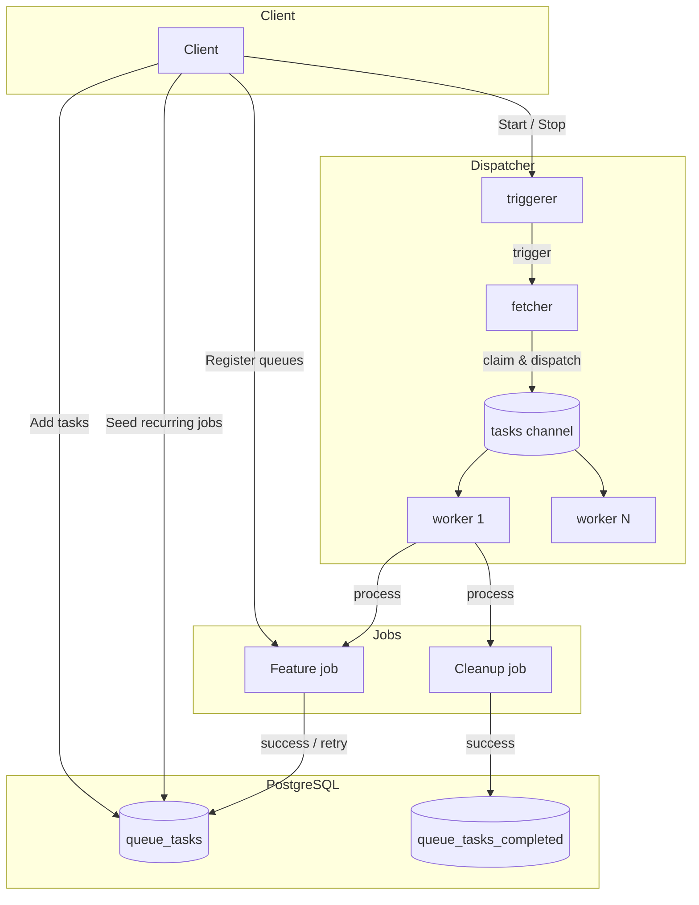

# Queue

Queue is tango's built-in task queue, built on PostgreSQL. It provides type-safe, persistent
task queues that run within the application — no external message broker required.

> **Origin:** based on [Backlite](https://github.com/mikestefanello/backlite) (MIT, originally
> SQLite-based), ported to PostgreSQL with the shared `datastore` pool, UUIDv7 primary keys,
> `TIMESTAMPTZ` columns, `go-sqlbuilder` query construction, and `encoding/json/v2` payloads.
> Upstream is no longer tracked: the engine is owned and evolved by tango.

## Features

- **Embedded execution** — workers run as goroutines inside your process, no separate service needed
- **Type-safe queues** — generic `NewQueue[T Task]` with compile-time type checking for payloads
- **Persistent** — tasks survive process restarts via PostgreSQL
- **Batch enqueue** — `Add(tasks...)` writes every task in one statement and one transaction
- **Dead letter queue** — a task that exhausted its attempts rests in the archive with its
  error, and `ReplayDead` brings the ones that kept their payload back with a fresh budget
- **Payload encryption at rest** — an optional `crypto.Cipher` seals every payload with
  AES-256-GCM (`queue.encrypt`)
- **Automatic retries** — configurable max attempts with a per-queue backoff
- **Atomic claims** — a single `UPDATE ... RETURNING` over `FOR UPDATE SKIP LOCKED`; two dispatcher
  instances never execute the same task twice
- **Delayed execution** — schedule tasks for later or set a wait duration
- **Graceful shutdown** — workers finish in-flight tasks before stopping
- **Completed task retention** — configurable policies for retaining success/failure records
- **Recurring maintenance as a job** — the completed-table cleanup is itself a queued job
  (`internal/jobs`), self-scheduled through the queue it maintains
- **Transaction-aware** — add tasks inside existing database transactions
- **Status tracking** — query task status by ID (pending / running / success / failure / not found)

## Architecture



**Goroutine model:** each `Start` runs one generation of goroutines; the fetcher is the only
place that touches the database for dispatching, and the workers only execute processors.

| Goroutine     | Role                                                                        |
| ------------- | --------------------------------------------------------------------------- |
| `triggerer`   | Converts ready signals into single trigger events (debounce)                 |
| `fetcher`     | Claims tasks from the DB and dispatches to workers; schedules the next fetch |
| `worker 1..N` | Executes task processors, recovering their panics                           |

**No polling — one fallback clock.** The engine is event-driven: a save notifies it, and a
delayed task arms the fetcher's ticker for its wait. When nothing is claimable the ticker
falls back to one minute, which is what reclaims a task whose worker was lost (its claim
expires after `queue.release_after`) without waiting for unrelated traffic. One cheap query
a minute is what a quiet queue costs.

## Requirements

- Go >= 1.27 (generics, stdlib `uuid` for UUIDv7 generation, `encoding/json/v2`)
- PostgreSQL >= 18 (native `uuidv7()` default in the schema)

## Wiring

The package lives inside the `tango` module and is not published. The composition root wires
it in `internal/registry`: the client is built from the shared `datastore.Postgres` pool with
the `queue` config section, and `internal/jobs.Register` lists the application's job queues
and seeds the recurring ones.

Schema is owned by the migrations (`database/migrations/00008_create_queue_tables.sql`) — run
`task db:migrate`; the client never creates tables itself.

The engine logs through `log/slog` — the same `*slog.Logger` the process built in
`internal/logger`, handed over by `serve` — so queue lines reach every configured sink
(console, file, OTLP) and carry the trace context of the run that logged them. Feature code
never builds a logger for the queue.

## Quick Start

### 1. Define a Task

A task is any struct that implements the `Task` interface — just provide a `Config()` method
that returns queue settings:

```go
package jobs

import (
    "time"

    "github.com/riipandi/tango/internal/queue"
)

// EmailTask represents an email to send.
type EmailTask struct {
    To      string `json:"to"`
    Subject string `json:"subject"`
    Body    string `json:"body"`
}

func (e EmailTask) Config() queue.QueueConfig {
    return queue.QueueConfig{
        Name:        "email",
        MaxAttempts: 3,
        Timeout:     30 * time.Second,
        Backoff:     10 * time.Second, // retry after 10s on failure
        Retention: &queue.Retention{
            Duration:   7 * 24 * time.Hour, // keep completed records for 7 days
            OnlyFailed: true,               // only retain failures
            Data: &queue.RetainData{
                OnlyFailed: true,
            },
        },
    }
}
```

Job definitions live in `internal/jobs/*_job.go` — one job per file — and every queue the
application runs is registered in `internal/jobs/register.go`.

### 2. Register and Run

The composition root does this; shown here for what it wires:

```go
client, err := queue.NewClient(queue.ClientConfig{
    Store:        pool,          // the shared datastore.Postgres
    Logger:       logger,        // the process *slog.Logger
    NumWorkers:   cfg.Queue.NumWorkers,
    ReleaseAfter: cfg.Queue.ReleaseAfter,
})

jobs.Register(ctx, client, cfg.Queue.CleanupInterval) // job queues + recurring seeds
client.Start(ctx)
```

`serve` starts the client before the listener opens and stops it through the injector's
shutdown walk (`Client` implements `do.ShutdownerWithContext`), so the in-flight tasks finish
after the HTTP drain ends.

### 3. Add Tasks

```go
// Immediate
ids, err := client.Add(EmailTask{
    To: "user@example.com", Subject: "Welcome", Body: "Hello!",
}).Save()

// Delayed
ids, err = client.Add(EmailTask{
    To: "user@example.com", Subject: "Reminder", Body: "Don't forget!",
}).Wait(1 * time.Hour).Save()

// At a specific time
ids, err = client.Add(EmailTask{
    To: "user@example.com", Subject: "Scheduled", Body: "This is scheduled.",
}).At(time.Now().Add(2 * time.Hour)).Save()

// Multiple tasks in one operation
ids, err = client.Add(
    EmailTask{To: "a@example.com", Subject: "Hi A"},
    EmailTask{To: "b@example.com", Subject: "Hi B"},
).Save()
```

### 4. Process Tasks from Another Task

The client rides the processor's context, so a task can enqueue the task that follows it:

```go
client.Register(queue.NewQueue[OrderTask](func(ctx context.Context, task OrderTask) error {
    queue.FromContext(ctx).Add(EmailTask{To: task.Email}).Save()
    return nil
}))
```

## Configuration

### `queue` section

| Key                    | Default | Description                                                                     |
| ---------------------- | ------- | ------------------------------------------------------------------------------- |
| `queue.num_workers`    | 5       | Worker goroutines that execute queued tasks concurrently                        |
| `queue.release_after`  | 10m     | How long a claimed task may run before the queue considers its worker lost      |
| `queue.cleanup_interval` | 1h    | How often the cleanup job purges the completed records retention has expired    |
| `queue.encrypt`        | false   | Seal task payloads at rest with `app.secret_key` (AES-256-GCM)                  |

Durations are written as plain numbers of seconds in the config file. `release_after` must
exceed the longest `Timeout` any queue configures, or a slow task would be claimed twice.
`queue.encrypt` requires `app.secret_key` to be set — validation refuses the combination of
an encrypted queue and a missing secret.

### `ClientConfig`

| Field          | Type            | Required | Description                                                  |
| -------------- | --------------- | -------- | ------------------------------------------------------------ |
| `Store`        | `queue.Store`   | Yes      | The shared Postgres pool (`Querier` + `WithTx`)               |
| `Logger`       | `*slog.Logger`  | No       | The process logger; nil discards every line                  |
| `NumWorkers`   | `int`           | Yes      | Worker goroutines (must be >= 1)                             |
| `ReleaseAfter` | `time.Duration` | Yes      | Fail-safe release for tasks whose worker was lost (must be > 0) |
| `Encryptor`    | `*crypto.Cipher`| No       | Seals payloads at rest when set (`queue.encrypt` wires it)   |

### `QueueConfig`

| Field         | Type            | Required | Description                                                     |
| ------------- | --------------- | -------- | --------------------------------------------------------------- |
| `Name`        | `string`        | Yes      | Unique queue name (duplicates or empty names panic)             |
| `MaxAttempts` | `int`           | Yes      | Maximum execution attempts before marking as completed (failed) |
| `Timeout`     | `time.Duration` | No       | Context deadline for each task execution (no timeout if zero)   |
| `Backoff`     | `time.Duration` | Yes      | Duration to wait before retrying a failed attempt               |
| `Retention`   | `*Retention`    | No       | Policy for retaining completed tasks (discarded if nil)         |

### `Retention` / `RetainData`

| Field        | Type            | Description                                                     |
| ------------ | --------------- | --------------------------------------------------------------- |
| `Duration`   | `time.Duration` | How long to keep completed records. Zero = forever.             |
| `OnlyFailed` | `bool`          | If true, only failed tasks are retained.                        |
| `Data`       | `*RetainData`   | Policy for retaining task payload data. Nil = no data retained. |
| `Data.OnlyFailed` | `bool`    | If true, only retain payload data for failed tasks.             |

## API Reference

### `NewClient(cfg ClientConfig) (*Client, error)`

Creates a new client. Validates the config and builds the dispatcher; nothing touches the
database until `Start` or the first `Save`.

### `(*Client).Register(queue Queue)`

Registers a queue so tasks can be added to it. Panics if a queue with the same name is
registered twice, or if the queue name is empty. Must be called before `Start()`.

### `(*Client).Add(tasks ...Task) *TaskAddOp`

Starts an operation to add one or more tasks. Returns a fluent builder:

```go
// Immediate
ids, err := client.Add(myTask).Save()

// Delayed
ids, err = client.Add(myTask).Wait(5 * time.Minute).Save()

// Scheduled
ids, err = client.Add(myTask).At(futureTime).Save()

// With context
ids, err = client.Add(myTask).Ctx(requestCtx).Save()

// Inside a transaction
tx, _ := pool.WithTx(ctx, func(ctx context.Context, tx datastore.Querier) error {
    _, err := client.Add(myTask).Ctx(ctx).Executor(tx).Save()
    return err
})
client.Notify() // required when using Executor()
```

### `(*Client).Start(ctx context.Context)`

Starts the dispatcher background goroutines. The provided context controls the main
lifecycle — cancelling it triggers shutdown.

### `(*Client).Stop(ctx context.Context) bool`

Attempts graceful shutdown. Waits up to the context deadline. Returns `true` if all workers
finished their tasks, `false` if the context was cancelled first.

```go
stopCtx, stopCancel := context.WithTimeout(context.Background(), 30*time.Second)
defer stopCancel()
if !client.Stop(stopCtx) {
    slog.Warn("some tasks did not finish gracefully")
}
```

### `(*Client).Shutdown(ctx context.Context)`

The `do.ShutdownerWithContext` form of `Stop`, called by the injector's shutdown walk. A
worker that did not finish in time is logged, because the task comes back on release
anyway.

### `(*Client).Status(ctx context.Context, taskID uuid.UUID) (TaskStatus, error)`

Returns the current status of a task by ID:

| Status               | Meaning                      |
| -------------------- | ---------------------------- |
| `TaskStatusPending`  | Queued but not yet executing |
| `TaskStatusRunning`  | Currently being processed    |
| `TaskStatusSuccess`  | Completed successfully       |
| `TaskStatusFailure`  | Completed with failure       |
| `TaskStatusNotFound` | No matching record found     |

A completed task that its queue did not retain reads as `TaskStatusNotFound`: the record is
gone, and the queue said that is the same as never having run.

### `(*Client).Notify()`

Notifies the dispatcher that a new task was added. **Only required when adding tasks inside
a transaction** (via `TaskAddOp.Executor()`), because the dispatcher cannot observe
transaction commits.

### `(*Client).Pending(ctx context.Context, queue string) (int64, error)`

Reports how many unclaimed tasks a queue holds. A recurring job reads it before seeding
itself, so a restart never adds a second schedule.

### `(*Client).Flush(ctx context.Context) (int64, error)`

Deletes all pending (unclaimed) tasks and returns how many were removed. Claimed tasks —
in flight or awaiting release — are untouched and will finish their lifecycle normally.

### `(*Client).FlushCompleted(ctx context.Context) (int64, error)`

Deletes all completed task records, bypassing retention expiry, and returns how many were
removed.

### `(*Client).DeleteExpiredCompleted(ctx context.Context) (int64, error)`

Deletes the completed records whose retention has expired. This is the maintenance the
cleanup job schedules; nothing else calls it.

### `(*Client).Dead(ctx context.Context, queue string) (int64, error)`

Reports how many dead tasks a queue's archive holds: the ones that exhausted their attempts.
They are the replay's raw material.

### `(*Client).ReplayDead(ctx context.Context) (int64, error)`

Re-enqueues the dead tasks the archive still carries under a fresh identity with a fresh
attempt budget, and reports how many went back. A dead task whose queue did not retain its
payload cannot come back — its content is gone, and it stays for the cleanup to expire.
The replay, the re-insert, and the archive removal share one transaction.

### `FromContext(ctx context.Context) *Client`

Retrieves the client from a processor context, allowing processors to enqueue follow-up
tasks. See "Process Tasks from Another Task".

## Database Schema

Two tables, created by migration `database/migrations/00008_create_queue_tables.sql`:

### `queue_tasks`

| Column             | Type          | Description                                |
| ------------------ | ------------- | ------------------------------------------ |
| `id`               | `UUID`        | Primary key, `uuidv7()` default            |
| `queue`            | `TEXT`        | Queue name                                 |
| `task`             | `BYTEA`       | JSON-encoded task payload                  |
| `attempts`         | `INTEGER`     | Execution attempt counter                  |
| `wait_until`       | `TIMESTAMPTZ` | Earliest execution time (NULL = ready now) |
| `claimed_at`       | `TIMESTAMPTZ` | When a dispatcher claimed this task        |
| `last_executed_at` | `TIMESTAMPTZ` | Last execution timestamp                   |
| `created_at`       | `TIMESTAMPTZ` | Original creation time                     |

**Index:** `idx_queue_tasks_fetch` on `(wait_until ASC, id ASC)` WHERE `wait_until IS NOT NULL`

### `queue_tasks_completed`

| Column                | Type          | Description                              |
| --------------------- | ------------- | ---------------------------------------- |
| `id`                  | `UUID`        | Primary key, `uuidv7()` default          |
| `queue`               | `TEXT`        | Queue name                               |
| `attempts`            | `INTEGER`     | Total execution attempts                 |
| `last_duration_micro` | `BIGINT`      | Last execution duration in microseconds  |
| `succeeded`           | `BOOLEAN`     | Whether execution succeeded              |
| `task`                | `BYTEA`       | Retained task payload (optional)         |
| `error`               | `TEXT`        | Error message (if failed)                |
| `expires_at`          | `TIMESTAMPTZ` | Auto-deletion time (NULL = keep forever) |
| `last_executed_at`    | `TIMESTAMPTZ` | Last execution timestamp                 |
| `created_at`          | `TIMESTAMPTZ` | Original creation time                   |

**Index:** `idx_queue_tasks_completed_expires` on `(expires_at)` WHERE `expires_at IS NOT NULL`

The pending table is small by construction: completed tasks move out, and a backlog is
bounded by what the application enqueues. The fetch queries are therefore allowed to scan
it — no second index worth maintaining.

## Transaction Support

Tasks can be added inside an existing database transaction, and the callback receives the
shared `datastore.Querier`, so the same surface every repository takes:

```go
err := pool.WithTx(ctx, func(ctx context.Context, tx datastore.Querier) error {
    if _, err := tx.Exec(ctx, "INSERT INTO orders (...) VALUES (...)"); err != nil {
        return err
    }

    _, err := client.Add(EmailTask{
        To:      "customer@example.com",
        Subject: "Order confirmed",
    }).Ctx(ctx).Executor(tx).Save()
    return err
})

// The tasks only became visible when the transaction committed.
client.Notify()
```

The task is enqueued with the change that caused it or not at all, which is what makes the
transaction worth the ceremony. Roll the transaction back and the tasks were never there.

## Graceful Shutdown

```go
client.Start(ctx)

// ... application lifetime ...

stopCtx, stopCancel := context.WithTimeout(context.Background(), 30*time.Second)
defer stopCancel()
if client.Stop(stopCtx) {
    slog.Info("all workers finished gracefully")
} else {
    slog.Warn("shutdown timed out — some tasks may be re-queued")
}
```

Hard-stop by cancelling the context passed to `Start`: in-flight tasks stop being waited
for, and their claims expire through `release_after`.

## Error Handling

- **Processor panics** are recovered and logged; the task is marked as failed
- **Max attempts exceeded**: task is moved to `queue_tasks_completed` with the error message
- **Backoff**: failed tasks are re-queued with `wait_until` set to `now + Backoff`
- **Stuck tasks**: `ReleaseAfter` reclaims tasks whose `claimed_at` expired; the claim wins
  atomically, so a task is never executed twice across dispatcher instances
- **Unregistered queue**: the task is re-queued on its own clock and logged; no attempt is
  spent on it, and a deploy that registers the queue picks it up as-is
- **Fetch failure**: the fetcher retries after a second rather than hammering the database
- **Failed save**: tasks added without an executor roll back together, and a rolled-back
  caller transaction leaves no task behind

## Testing

Tests run against a real Postgres (testcontainers, Postgres 18) using the shared
`pkg/testutils.StartPostgres` helper; each test migrates its own database
(`NewDatabase`), so no state leaks between tests.

```bash
go test ./internal/queue/
go test -race ./internal/queue/
```

## Design Decisions

| Decision                              | Rationale                                                                                         |
| ------------------------------------- | ------------------------------------------------------------------------------------------------- |
| UUIDv7 primary keys, generated in Go  | Time-sortable and referenceable before any commit; the DB default exists for rows inserted elsewhere |
| Atomic claim (`UPDATE ... RETURNING`) | Contended tasks are never executed twice across dispatcher instances                               |
| `FOR UPDATE SKIP LOCKED`              | A competing dispatcher skips locked rows instead of blocking or failing                            |
| Payloads cloned out of the encode buffer | The buffer is reused across a batch; a shared backing array would rewrite earlier tasks' bytes   |
| Encryption seals on write, detects on read | `queue.encrypt` flipped mid-flight: sealed payloads carry `crypto.EncPrefix`, an in-flight plaintext task still runs |
| TIMESTAMPTZ everywhere                | Consistent timezone handling, no ambiguity                                                        |
| go-sqlbuilder                         | Type-safe query construction, PostgreSQL flavor, matching the seeders' idiom                       |
| Channel-based task distribution       | Low-latency dispatch, no polling overhead beyond the one-minute fallback                            |
| Non-blocking ready signal             | Prevents deadlock when the triggerer exits before all producers                                    |
| Schema owned by migrations            | One source of schema truth; the client never mutates the schema                                    |
| Cleanup as a job, not a goroutine     | Recurring maintenance belongs in `internal/jobs`, next to the other jobs                            |
| No external dependencies for queuing  | Eliminates Redis/RabbitMQ as operational requirements                                              |
| No web UI                             | Upstream's monitoring UI was not ported; the API surface is the contract                            |

## Credits

Based on [Backlite](https://github.com/mikestefanello/backlite) by Mike Stefanello, adapted
for PostgreSQL and the tango architecture.
