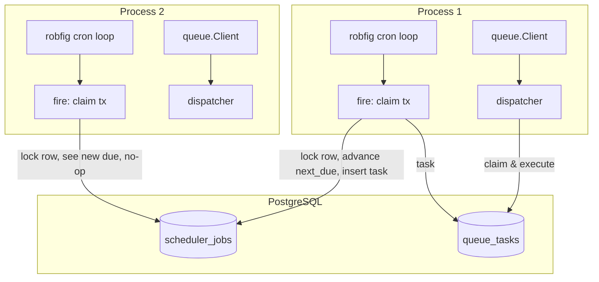

# Scheduler

Scheduler is tango's durable cron scheduler, built on PostgreSQL. It fires tasks at cron
times across any number of replicas, where exactly one replica wins each tick — no external
scheduler service, no leader election, no paid module.

> **Relation to the queue:** the scheduler is the trigger; the queue (`internal/queue`) is
> the executor. A claimed tick enqueues a task onto the queue, which owns execution, retries,
> backoff, and the archive. The scheduler never runs business logic, and a tick's claim and
> its task's insert are one transaction — a tick is never lost between the two and never
> enqueued twice.
>
> **Relation to River:** the periodic-job shape is the same the mature engines use — a
> schedule object that answers `Next(time)`, an atomic claim so one replica wins, and a
> transactional enqueue. River gates the durable form of this behind its Pro subscription;
> this package is that idea, owned here.

## Features

- **Durable schedule state** — every job's due time lives in `public.scheduler_jobs`
  (migration `00008`), so a restart resumes the schedule a row already carries
- **Exactly one winner per tick** — every replica fires the cron time, and the one that
  moves `next_due` forward wins; the others read a future due time and do nothing
- **Transactional claim + enqueue** — the row lock (`FOR UPDATE`), the due-time advance,
  and the queue task's insert share one `WithTx`; a crash cannot lose a claimed tick or
  enqueue a duplicate
- **The database is the clock** — the due comparison reads `now()` from the transaction,
  so replica clock skew cannot double-fire a tick
- **Cron specs + intervals** — standard 5-field cron, `@every`, and the `@` descriptors
  robfig/cron parses; a spec that names no zone resolves in `scheduler.timezone`
- **Per-job priority** — `Job.Priority` rides the enqueue: a higher number is claimed
  by the dispatcher first, the way `Add(task).Priority(n)` ranks a plain task
- **Graceful stop** — `Stop` waits for the fires in flight, and an enqueued tick is durable
  regardless
- **Zero-dependency timing** — `robfig/cron/v3` v3.0.1 carries no dependencies of its own

## Architecture



Both processes fire at the cron time. `fire` opens one transaction: it locks the job's
state row, reads the database clock, and compares. The first process in moves `next_due`
forward and inserts the task; the second reads the already-advanced due time and returns.
The task is enqueued inside that same transaction, then `Notify` wakes the dispatcher.

**Missed ticks.** The next due time advances from the *old* due, never from now — a cron
spec that was down for hours resumes at its next cron mark, skipping what it missed, and an
`@every` spec catches up one slot at a time. There is no burst, and no run is silently
double-scheduled.

## Requirements

- Go >= 1.27 (the `robfig/cron/v3` dependency carries no transitive dependencies)
- PostgreSQL >= 18 (shared with the queue — no separate backend)
- `internal/queue` — the claimed tick enqueues onto the queue client

## Wiring

The package lives inside the `tango` module and is not published. The composition root
wires it in `internal/registry`: the scheduler is built from the shared `datastore.Postgres`
pool and the queue client, and its job list comes from `jobs.Scheduled()` in
`internal/jobs/register.go` — the same one place the application's job lists are spelled
out.

Schema is owned by the migration (`database/migrations/00008_create_scheduler_tables.sql`,
shared with the queue's tables) — run `task db:migrate`; the scheduler never creates tables
itself.

The engine logs through `log/slog` — the process logger `serve` hands over — so scheduler
lines reach every configured sink and carry the trace context of the run.

## Quick Start

### 1. Define the Task

A scheduled job is a queue task first: the tick enqueues it, the queue runs it.

```go
package jobs

import "github.com/riipandi/tango/internal/queue"

// ReportTask builds the daily report.
type ReportTask struct {
	Date string `json:"date"`
}

func (t ReportTask) Config() queue.QueueConfig {
	return queue.QueueConfig{
		Name:        "report",
		MaxAttempts: 3,
		Timeout:     5 * time.Minute,
		Backoff:     time.Minute,
	}
}
```

### 2. List It in `jobs.Scheduled()`

```go
func Scheduled() []scheduler.Job {
	return []scheduler.Job{
		{
			Name: "daily-report",           // the state row's key
			Spec: "0 6 * * *",              // 06:00 in scheduler.timezone
			Task: ReportTask{Date: "today"},
			// Priority: 5,            // optional: the dispatcher claims higher first
		},
	}
}
```

The name must be unique, the task must be non-nil, and the spec must parse — `New` refuses
each, because a job that cannot be told apart or never parses is a wiring bug, not a
run-time condition. `Priority` is optional and defaults to zero; a negative value is
refused at enqueue time, as it is for a plain queue task.

### 3. Wiring and Lifecycle

The composition root does this; shown here for what it wires:

```go
location, _ := time.LoadLocation(cfg.Scheduler.Timezone)
s, err := scheduler.New(scheduler.Config{
	Store:    pool,          // the shared datastore.Postgres
	Client:   queueClient,   // the queue client the ticks enqueue onto
	Logger:   logger,
	Location: location,
	Jobs:     jobs.Scheduled(),
})
s.Start(ctx)   // after the queue starts, before the listener opens
```

`serve` starts the scheduler after the queue and stops it first in the shutdown walk: a
fire in flight finishes its enqueue against the dispatcher, and the enqueued task is durable
through the queue's own drain.

## Configuration

### `scheduler` section

| Key                  | Default | Description                                                    |
| -------------------- | ------- | -------------------------------------------------------------- |
| `scheduler.timezone` | UTC     | Resolves a spec that names no zone — "0 3 * * *" is 03:00 here |

### `Config`

| Field      | Type              | Required | Description                                        |
| ---------- | ----------------- | -------- | -------------------------------------------------- |
| `Store`    | `queue.Store`     | Yes      | The shared Postgres pool (`Querier` + `WithTx`)    |
| `Client`   | `*queue.Client`   | Yes      | The queue client claimed ticks enqueue onto        |
| `Logger`   | `*slog.Logger`    | No       | The process logger; nil discards every line        |
| `Location` | `*time.Location`  | No       | Spec zone resolution; nil is UTC                   |
| `Jobs`     | `[]Job`           | No       | The scheduled enqueues this scheduler runs         |

### `Job`

| Field      | Type         | Description                                                       |
| ---------- | ------------ | ----------------------------------------------------------------- |
| `Name`     | `string`     | Unique job name; the state row's primary key                      |
| `Spec`     | `string`     | Cron spec (standard 5-field, `@every`, `@` descriptors, `TZ=`)     |
| `Task`     | `queue.Task` | The task a claimed tick enqueues                                  |
| `Priority` | `int`        | Claim rank handed to the enqueued task, higher first (default `0`)|

## API Reference

### `New(cfg Config) (*Scheduler, error)`

Builds the scheduler and parses every spec once. Refuses a missing store or client, an
empty or duplicated job name, a nil task, and a spec that does not parse.

### `(*Scheduler).Start(ctx context.Context)`

Seeds the state rows (`ON CONFLICT DO NOTHING` — a row a previous deploy created keeps its
due time) and runs the cron loop. The context cancels the fires, not the loop: use `Stop`
for a graceful drain.

### `(*Scheduler).Stop(ctx context.Context) bool`

Stops the cron loop and waits until the fires in flight finish — robfig's stop context
closes when they do. Returns `true` when every fire finished in time.

## Database Schema

One table, created by migration `database/migrations/00008_create_scheduler_tables.sql`
(shared with the queue's two tables):

### `scheduler_jobs`

| Column       | Type          | Description                                        |
| ------------ | ------------- | -------------------------------------------------- |
| `name`       | `TEXT`        | Primary key — the job's unique name                |
| `spec`       | `TEXT`        | The cron spec, kept for operators                  |
| `next_due`   | `TIMESTAMPTZ` | The tick the schedule owes next — the claim cursor |
| `last_fired` | `TIMESTAMPTZ` | When the last tick was claimed (NULL = never)      |
| `updated_at` | `TIMESTAMPTZ` | Row bookkeeping                                    |

Named checks guard the text lengths (`scheduler_job_name_length`,
`scheduler_job_spec_length`), the convention the queue tables and the mature engines share.

The table is small by construction — one row per registered job — and read per job through
its primary key. No index beyond it.

## Testing

Tests run against a real Postgres (testcontainers, Postgres 18) using the shared
`pkg/testutils.StartPostgres` helper; each test migrates its own database (`NewDatabase`),
so no state leaks between tests.

```bash
go test ./internal/scheduler/
go test -race ./internal/scheduler/
```

Covered: construction refusals, a claimed tick (enqueue + due advance + `last_fired`), the
job's priority landing on the enqueued task, two schedulers where only one wins, the full
cron loop against a running dispatcher, a stopped scheduler firing nothing, and the
resume-from-stale-due shape.

## Design Decisions

| Decision                                   | Rationale                                                                                    |
| ------------------------------------------ | -------------------------------------------------------------------------------------------- |
| A state table, not a queue table           | The scheduler only decides *who fires the tick*; payload, retries, and archive belong to the queue |
| Row lock (`FOR UPDATE`), no leader election | Every replica may fire; the first commit moves the cursor. No election table, no leader lifecycle, no split-brain window |
| `next_due` advances from the old due       | Cron specs resume at their next mark instead of bursting; interval specs catch up one slot at a time |
| The database is the clock                  | Replica clock skew cannot double-fire; the transaction's `now()` decides                     |
| Claim and enqueue in one transaction       | A crash between the two is impossible; a tick is enqueued exactly once                        |
| `TZ=` prepended at parse time              | robfig's `WithLocation` sets the run loop's clock but not the parser's; the prefix is the documented way |
| robfig/cron v3, zero dependencies          | Parsing and the run loop are the only asks; a scheduler framework would be a second dependency for nothing |
| Jobs registered in code                    | Specs are wiring, like the queue list; runtime-editable schedules need a UI and a review process of their own |
| No scheduler-side retries                  | A failed tick leaves `next_due` untouched and retries at the next firing; the task's own attempts live in the queue |

## Credits

The periodic-job shape follows [River](https://github.com/riverqueue/river) (MIT) — whose
open-source periodic enqueuer this design mirrors, minus the leader election its
coordination needs and the durable state its Pro subscription sells. Timing by
[robfig/cron](https://github.com/robfig/cron) v3.
